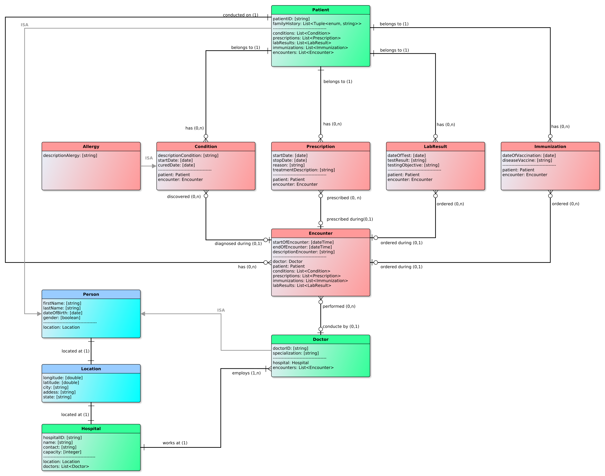
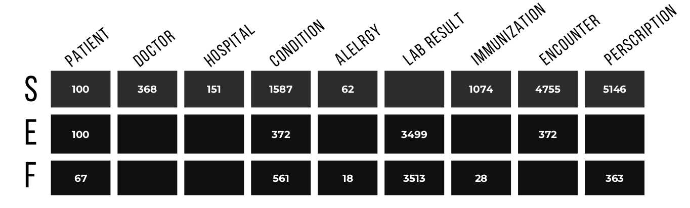
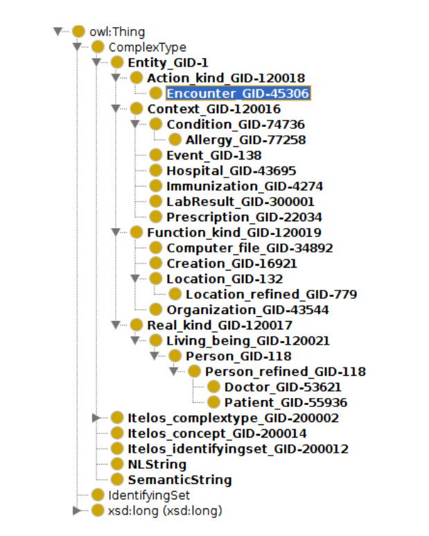

#### Academic year 2021/2022, University of Trento
 
 

### Project Description
The aim of the project is to build a knowledge graph (KG) concerning healthcare heterogeneous data about patients, professionals, facilities and other entities from European countries with different healthcare systems. This result could be the foundation to create a service which help the citizens to handle their own healthcare data, in a context in which the citizens moves around Europe.    
In this project we used syntetic (alrady anonymized) data to create a prototype integration serving this purpose. We followed the iTelos development methodology and improved our soulution incrementaly - starting from hypothetical use cases all the way to the final, exploitable knowledge graph while evaluating each step of the procedure.    
This solution can potentially be used in clinics, pharmacies, hospitals and research institutions by various personel. Security and data access aspects have not been covered in this project - the application level exploiting this KG should take care of these.
 
 

### Resources
#### Knowledge Resources:
- [FHIR](https://www.hl7.org/fhir)
- [Schema](https://schema.org)

#### Data Resources  
- [Synthea](https://synthea.mitre.org/) - 100 patients
- [EMRBOTS](http://www.emrbots.org) - 100 patients
- [FHIR SMART data](https://github.com/smart-on-fhir/sample-patients) - 67 patients

- All datasets have been retrieved in csv format. They vaired greatly in the number of object and data properties with Synthea being the richest one and FHIR SMART data being the poorest one. These datasets have all been synthetically generated, therefore there was no need for anonymization.
 
 

### ER generation and data filtering 

Core eTypes are green, common ones in blue and contextual ones in red.

 

This diagram was defined by looking at the available data, the project’s purpose and the competency questions. However, this procedure made us rethink about all the possible competency questions our solutions can provide an answer to, therefore we decided expand. Doing this allowed us to incorporate a larger amount of diverse data while still maintaining sparsity at a fairly low level.

 

We introduced the Person eType in order to avoid redundancy of defining basic information about our personas (Doctor and Patient). Both of these eTypes extend the eType Person with additional properties unique to them. Moreover, we changed the eType Allergy to be an extension of the eType Condition. Initially, there were two distinct eTypes due to the fact that they were categorized differently in our initial datasets. However, after observing that these entities share all attributes we connected them via IS-A relationship.

 

After filtering on the data level the following numbers of instances were obtained: 

 
 

### ETG generation and data integration
 
We started by using the predefined ontology adapted for the iTelos methodology. This ontology template was then was imported into Protégé. 

 

Only minor differences have been made with comparison to what was the output of the informal modelling phase:

- The eTypes Person_refined and Location_refined have been added to provide extensions to the Person_GID-118, Location_GID-132 eTypes already existing in the template.These were added as subclasses.

- Due to the limited number of data types allowed to be used in the template (defined by the
course), the data property familyHistory of Patient was changed to String type. All of the
other data and object properties have been preserved compared to the output of informal modelling phase.
- It should be noted that both reverse relationship have not been placed nor the cardinalities.
In all cases where exists an one-to-many relationship, only the side where Domain(Many)-to-Range(one) is modeled.
ETypes that have an ISA property have been modeled as a subclass of the more abstract EType.

 

Next, we uploaded the base-schema to KOS in order to integrate it with the framework
ontology provided by UKC (a multilingual lexico-semantic resource - Universal Knowledge
Core).
Here,during the language alignment process, a number of eTypes and especially data properties
was not found in the UKC - therefore they had to be added. In many cases where the concept
had to be added, a more abstract concept could have been selected as a synonym. However,
to preserve exactness and expend the UKC resource, new concepts were placed.
 
This procedure resulted in a fully formal ETG. Its structure is shown below:
 

 
On the data level, the three datasets were joined using LibreOffice and command-line tools. All of the column
names were renamed in such way to represent the same things. Each instance of each eType
has been appended with a string value denoting which dataset it is originating from. For all
eTypes all object and data properties were present, exepct for familyHistory of Patient eType.
Due to a very low number of instances, it was decided for it to be removed from downstream
integration since it will cause sparsity. We then resolved all data type and format misalignments amont the datasets. All of our
simulated data was in English, therfore no language misalignments existed. After these steps, we have nine separete csv tables each
representing an eType with its properties.
 

All nine csv files describing our eTypes and their properties have been uploaded to Karmalinker.
As the ontology, the ETG given by KOS was used. Prior to entity matching, some leftover syntactic issues
had to be solved:
- All date formats in all files have been converted to ISO format. Now all properties of all
eTypes have the same data types across datasets.
- IDs were assigned to the following eTypes: Allergy, Condition, Prescription, LabResult and
Immunization. This was simply done by assigning unique integer values to each instance
of the mentioned eTypes.
 
These modification made possible to preform entity aligning. No errors or difficulties were
came across during this procedure. Since this project deals with simulated data, no entity matching had to be done. After integrating our data successfully, the knowledge graph is ready to be utilized in NeoJ4’s Graphdb by answering some questions similiar to our initial CQs.

